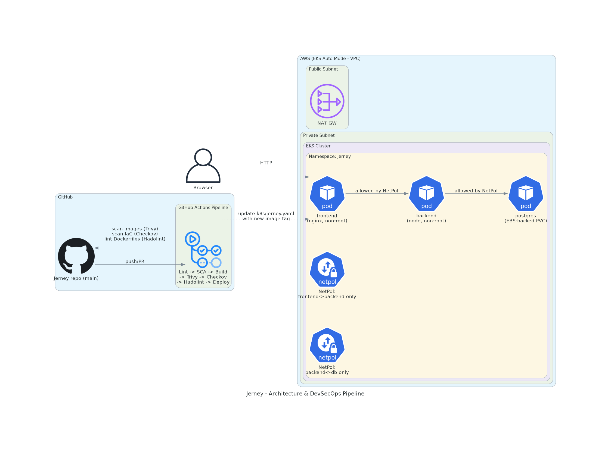
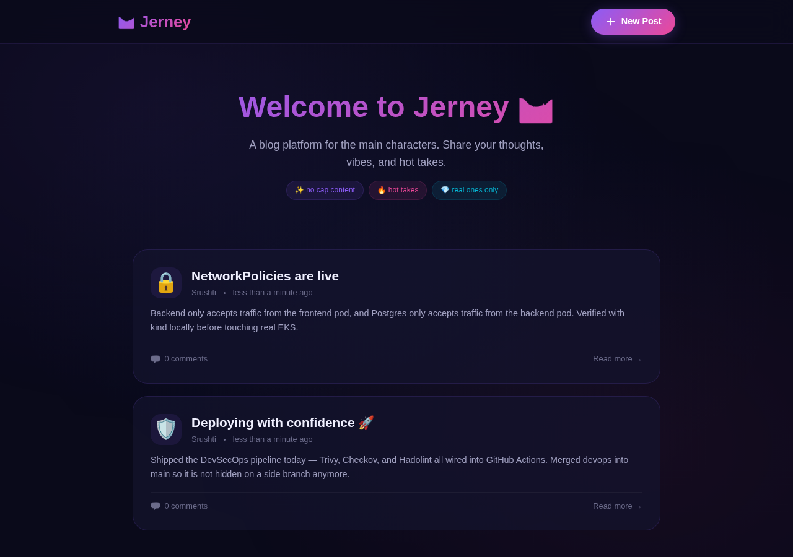

# 🛤️ Jerney — Blog Platform

A Gen-Z vibe blog platform built with a 3-tier architecture — React frontend, Node.js backend, and PostgreSQL database — with a DevSecOps pipeline (Docker, Kubernetes, Terraform/EKS, GitHub Actions with Trivy/Checkov/Hadolint) built around it.


---

## ✨ Features

- 📝 Create blog posts with emoji vibes
- ✏️ Edit your existing posts
- 🗑️ Delete posts you're not feeling anymore
- 💬 Comment on posts
- 🎨 Gen-Z dark UI with glassmorphism and gradients

## 🏗️ Architecture



Three-tier app (React/Nginx → Node/Express → PostgreSQL) running as three pods in a single `jerney` namespace on EKS, with `NetworkPolicy` objects restricting traffic to frontend→backend and backend→db only. Every push/PR runs the app through a GitHub Actions pipeline (lint → dependency audit → build → image scan → IaC scan → Dockerfile lint) before an image tag is ever written into the Kubernetes manifest. See [Security & CI/CD](#-security--cicd) below for exactly what each stage does and whether it blocks or just reports.

## 📁 Project Structure

```
Jerney/
├── .github/workflows/
│   ├── ci-cd.yml              # Main DevSecOps pipeline (lint/SCA/build/Trivy/Checkov/Hadolint)
│   └── sim-security-scan.yml  # Optional: posts PR metadata to an external AI review webhook
├── frontend/                  # React (Vite) frontend
│   ├── src/                   # React components & pages
│   ├── Dockerfile             # Multi-stage build, runs as non-root nginx user
│   └── nginx.conf
├── backend/                   # Node.js Express API
│   ├── src/                   # Routes, DB connection
│   └── Dockerfile             # Multi-stage build, runs as non-root appuser
├── k8s/
│   └── jerney.yaml             # Namespace, Secret, PVC, Deployments, Services, NetworkPolicies
├── terraform/                  # EKS (Auto Mode) + VPC via Terraform
│   ├── main.tf
│   ├── variables.tf / terraform.tfvars
│   └── outputs.tf
├── docker-compose.yml          # Local multi-container dev environment
├── .checkov.yml                # IaC scan config (skips + framework selection)
├── deploy/                     # EC2 (non-container) deployment scripts
│   ├── setup.sh
│   └── jerney-nginx.conf
└── README.md
```

---

## 🔐 Security & CI/CD

This is the honest, verified state of the pipeline as of this README — every claim below was checked by actually running the tool against this repo's own files, not copied from a template.

### Pipeline stages (`.github/workflows/ci-cd.yml`)

Runs on every push and PR to any branch:

1. **Lint** (`eslint`) — backend and frontend, run in parallel. **Blocks** on ESLint errors (warnings pass). Verified clean on backend; frontend currently has 2 non-blocking `react-hooks/exhaustive-deps` warnings.
2. **SCA / dependency audit** (`npm audit --audit-level=high`) — backend and frontend. Command is run with `|| true` in the workflow, so **it reports but never blocks the pipeline**. Backend has 3 moderate vulnerabilities (transitive, via `express`→`body-parser`→`qs`), tracked but not yet fixed. Frontend previously had 4 findings (3 moderate + 1 high, via `vite`/`esbuild` and `react-router`), fixed by upgrading to Vite 7 and react-router-dom 7.18, verified the app and production build still worked, then committed. Currently 0 vulnerabilities on frontend.
3. **Build** — multi-stage Docker builds for both images, pushed to GHCR (`ghcr.io/<repo>/jerney-backend` / `-frontend`) with SBOM and provenance attestation enabled. Only pushes on non-PR events.
4. **Image scan** (Trivy, `aquasecurity/trivy-action`) — scans the built image filesystem for OS and library vulnerabilities. `severity: CRITICAL,HIGH`, `exit-code: 1` → **this blocks the pipeline** if a critical/high vulnerability is found in either image. Not hypothetical: the frontend image's `alpine 3.21.3` base initially had 34 CRITICAL/HIGH findings (32 HIGH, 2 CRITICAL), confirmed by a real failing Actions run. Fixed by adding apk upgrade to both Dockerfiles. A small number of CVEs remain explicitly suppressed via .trivyignore in each service folder, documented per-CVE. Both image scans currently pass. `fail-fast: false` on the scan matrix so the backend and frontend results are never hidden by each other.
5. **IaC scan** (Checkov) — two separate runs:
   - **Terraform** (`terraform/`): invoked directly (`checkov -d terraform/ ...`, pinned to `checkov==3.3.16`) rather than through `bridgecrewio/checkov-action@v12` — that action was tried first but crashes this checkov version with `AssertionError: config parser should convert anything that is not a list to string.` because it builds `--skip-check` as one repeated flag per value instead of a single comma-separated one. Verified locally that the direct invocation doesn't have this problem, then fixed the workflow the same way. No soft-fail → **blocks**. Two checks (`CKV_AWS_39`, `CKV_AWS_58` — public EKS API endpoint) are explicitly skipped with a documented reason (needed for `kubectl` access from outside the VPC on a dev cluster). Everything else is enforced. `CKV_TF_1` ("module sources use a commit hash") previously failed for both the VPC and EKS modules, because they're pinned by semantic version (`~> 5.0`, `~> 20.31`) against the public Terraform Registry rather than a git commit hash — a common and reasonable pattern for registry modules, but Checkov flags it regardless. This was left failing initially to confirm the pipeline's blocking behavior actually worked, then explicitly skipped with a documented justification. The check currently passes.
   - **Kubernetes** (`k8s/`): `soft_fail: true` → **reports only, does not block**. Real findings on the current manifest include missing pod/container `securityContext`, missing memory limits on the backend, and no `NetworkPolicy` covering the frontend pod's egress (the two NetworkPolicies that exist only cover db and backend ingress).
6. **Dockerfile lint** (Hadolint) — `failure-threshold: warning` → **blocks** on any warning-or-above finding in either Dockerfile. This actually caught something real: the initial merge had `DL3018` (unpinned `apk add`) on `backend/Dockerfile`'s `dumb-init` install, confirmed by a real failing run in Actions, not a hypothetical. Explicitly suppressed with `# hadolint ignore=DL3018` and a comment explaining why (no registry access at review time to confirm the exact pinned build available in the base image, and a wrong guess risks a broken build, which is worse than an unpinned single static binary) — a documented trade-off, not a silent skip.
7. **Update K8s manifest** — only on `push` to `main`, and only if build + image-scan + iac-scan + dockerfile-lint all succeeded. Rewrites the image tags in `k8s/jerney.yaml` to the new commit SHA and pushes that change back to `main` with `[skip ci]`. Now that the Terraform IaC scan passes (see above), **this step runs on every push to `main`**, promoting the new image tag automatically since all upstream gates pass.

### Second, optional workflow (`sim-security-scan.yml`)

Fires on PR open/sync and POSTs the PR's metadata to an external webhook (`sim.ai`) using a `SIM_API_KEY` repository secret. This is **not** part of the Trivy/Checkov gate above — it's a separate, optional AI-based PR reviewer. If `SIM_API_KEY` isn't configured as a repo secret, this workflow runs and fails on the HTTP call rather than doing anything meaningful. Treat it as an experimental add-on, not a security control to rely on.

### What "passing" actually means here

The pipeline is a real gate for image vulnerabilities (Trivy), Dockerfile hygiene (Hadolint), and Terraform IaC (Checkov) — a bad image or a genuinely risky Terraform change will fail the run and block the auto-update of the K8s manifest. It is **not** a gate for dependency vulnerabilities (SCA) or Kubernetes manifest hygiene (Checkov K8s) — those are visibility-only today, by explicit config choice (`soft_fail: true` / `|| true`), not by accident.

---

## ☸️ Deploy on Kubernetes (EKS)

> **Cost warning:** the Terraform in `terraform/` provisions a real EKS cluster (control plane has an hourly charge with no free tier) and a NAT Gateway (also not free-tier eligible). Do not `terraform apply` this against a free-tier/student AWS account without understanding the cost, and always `terraform destroy` immediately after you're done verifying it works. For local testing of the Kubernetes manifests and NetworkPolicies without any AWS cost, use `kind` or `minikube` instead (see below).

### Test locally first (free, no AWS account needed)

```bash
kind create cluster --name jerney
kubectl apply -f k8s/jerney.yaml
kubectl get pods -n jerney
kubectl get networkpolicy -n jerney
kind delete cluster --name jerney
```

### Provision real infrastructure (billable — read the cost warning above)

```bash
cd terraform
terraform init
terraform plan
terraform apply         # creates EKS + VPC + NAT Gateway — billable
aws eks update-kubeconfig --region <region> --name jerney-eks
kubectl apply -f ../k8s/jerney.yaml
# ... verify, screenshot, whatever you need to prove ...
terraform destroy       # tear it down as soon as you're done
```

---

## 🐳 Local Development (Docker Compose)

The fastest way to run the full stack locally with no cloud dependency:

```bash
docker compose up --build
```

This builds and starts the PostgreSQL database, backend API, and frontend (served on port `8080`) as three containers, with the same non-root/read-only hardening used in the production Dockerfiles.

---

## 🚀 Deploy on AWS EC2 (non-container)

### Prerequisites

- An AWS EC2 instance running **Ubuntu 22.04+**
- Security Group allowing inbound traffic on ports **22** (SSH) and **80** (HTTP)
- SSH access to the instance

### Step 1: Transfer the Code to EC2

```bash
# From your local machine
scp -r -i your-key.pem ./Jerney ubuntu@<EC2_PUBLIC_IP>:~/Jerney
```

### Step 2: SSH into the Instance

```bash
ssh -i your-key.pem ubuntu@<EC2_PUBLIC_IP>
```

### Step 3: Run the Setup Script

The `deploy/setup.sh` script installs everything and configures the app automatically:

```bash
cd ~/Jerney
chmod +x deploy/setup.sh
./deploy/setup.sh
```

This script will:
1. Update system packages
2. Install **Node.js 20.x**, **PostgreSQL 16**, **Nginx**, and **PM2**
3. Create the database and user
4. Install backend dependencies
5. Build the React frontend
6. Configure Nginx as a reverse proxy
7. Start the backend with PM2 (auto-restarts on crash/reboot)

### Step 4: Access the App

Open your browser and go to:

```
http://<EC2_PUBLIC_IP>
```

### Useful Commands

```bash
pm2 status                          # Check backend status
pm2 logs                            # View backend logs
pm2 restart all                     # Restart backend
sudo systemctl restart nginx        # Restart Nginx
sudo -u postgres psql -d jerney_db  # Connect to database
```

---

## 🧑‍💻 Local Development (Without Docker)

### Prerequisites

- Node.js 20+
- PostgreSQL 16+

### Backend

```bash
cd backend
npm install

# Create a .env file (or export these variables)
export DB_HOST=localhost
export DB_PORT=5432
export DB_USER=jerney_user
export DB_PASSWORD=jerney_pass_2026
export DB_NAME=jerney_db
export PORT=5000

npm start
```

### Frontend

```bash
cd frontend
npm install
npm run dev
```

The Vite dev server starts on `http://localhost:3000` and proxies `/api` requests to the backend at `http://localhost:5000`.

---

## 📡 API Endpoints

| Method | Endpoint | Description |
|--------|----------|-------------|
| GET | `/api/health` | Health check |
| GET | `/api/posts` | Get all posts |
| GET | `/api/posts/:id` | Get single post with comments |
| POST | `/api/posts` | Create a new post |
| PUT | `/api/posts/:id` | Update a post |
| DELETE | `/api/posts/:id` | Delete a post |
| GET | `/api/comments/post/:postId` | Get comments for a post |
| POST | `/api/comments` | Create a comment |
| DELETE | `/api/comments/:id` | Delete a comment |

---

## 📸 Proof

**App running** (backend on Node/Express + Postgres, frontend on Vite, screenshotted from a real running instance — not a mockup):



**Pipeline run** — see the [Actions tab](../../actions) for the live run history on `main`. Every stage currently passes on `main`. Real issues were found and fixed along the way: the Terraform IaC scan initially failed on `CKV_TF_1` (see above, now skipped with documented justification), and Trivy initially blocked the frontend image over 34 CRITICAL/HIGH vulnerabilities in its Alpine base (now patched). Also fixed along the way, visible in the commit history: a `bridgecrewio/checkov-action@v12` crash (replaced with a direct, pinned `checkov` invocation) and a `DL3018` Hadolint finding on the backend Dockerfile (explicitly suppressed with a documented reason).

---

Built with 💜 by the Jerney team. No cap, this blog platform hits different. 🛤️
